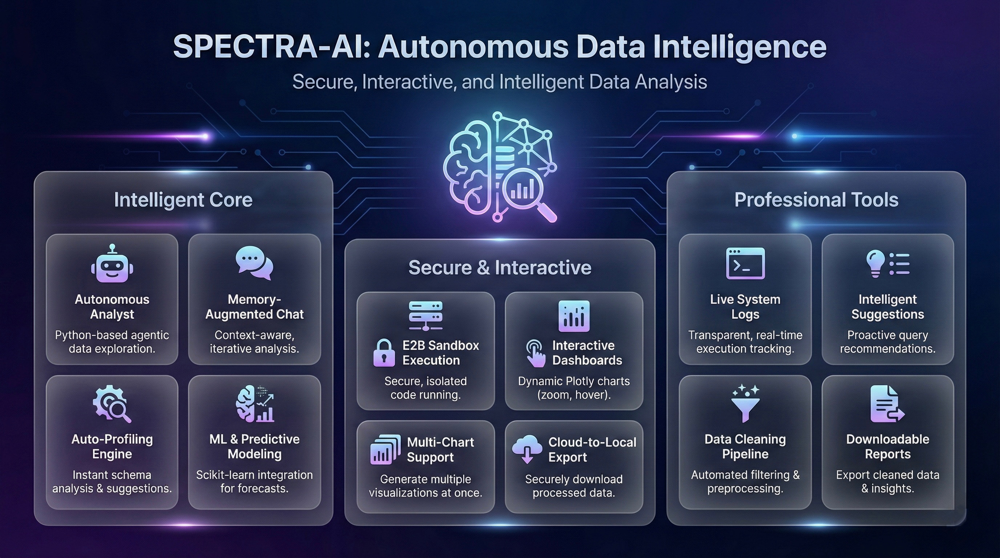
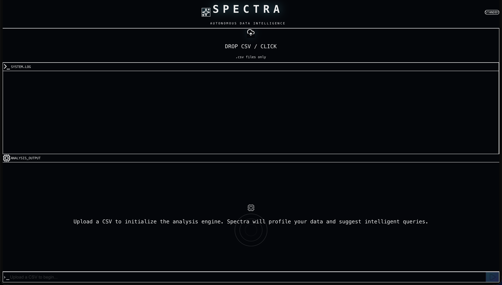

# ⚡️ Spectra: Autonomous AI Data Analyst

Spectra is a next-generation **AI Data Agent** that bridges the gap between raw data and actionable insights. Unlike standard chatbots, Spectra doesn't just "talk" about data—it **writes and executes Python code** in a secure cloud sandbox to analyze datasets, generate visualizations, and browse the live internet to explain *why* trends are happening.

## 🚀 Features

### 🧠 Intelligent Core
* **🤖 Autonomous Analyst:** Independently analyzes, visualizes, and extracts insights from raw CSV data without manual intervention.
* **🔍 Auto-Profiling Engine:** The moment a file is uploaded, Spectra silently parses the schema, infers data types, and proactively generates contextual, high-value query suggestions.
* **💭 Memory-Augmented Chat:** Powered by LangGraph Checkpoints, Spectra retains conversational context, allowing you to iteratively explore data and modify previous charts on the fly.
* **📈 ML & Predictive Modeling:** Automatically handles missing values, writes `scikit-learn` pipelines, trains models, and plots feature importance or evaluation metrics.

### 🛡️ Secure & Interactive
* **☁️ E2B Sandbox Execution:** Runs all generated Python code in a highly secure, isolated cloud environment. Zero risk to your local machine.
* **📊 Interactive Dashboards:** Generates dynamic, responsive charts using Plotly. Hover, zoom, and pan through your data in real-time.
* **🗂️ Multi-Chart Support:** Moves beyond single-chart outputs to generate comprehensive, responsive CSS-grid dashboards with multiple visualizations at once.
* **📥 Cloud-to-Local Export:** Seamlessly syncs manipulated and cleaned datasets from the cloud sandbox back to your local machine for one-click downloading.

### 💼 Professional Tools
* **🔎 Context-Aware Web Search:** Uses the Tavily API to fetch real-world historical context, news, or policy changes to explain anomalies in your data.
* **💻 Live System Logs:** Provides real-time visibility into the agent's "thought process" and code execution via a sleek, animated terminal UI.
* **✨ Glassmorphism UI:** A premium, dark-mode aesthetic featuring Framer Motion animations, streaming markdown, and glowing status indicators.

---

## 🛠️ Tech Stack

### **Frontend (The "Wow" Factor)**
* **Framework:** Next.js 14 (App Router)
* **Styling:** Tailwind CSS + Framer Motion
* **Visualizations:** Plotly.js (`react-plotly.js`)
* **Icons:** Lucide React

### **Backend (The "Brain")**
* **API:** FastAPI (Python)
* **Orchestration:** LangChain + LangGraph (with `MemorySaver` Checkpoints)
* **LLM:** OpenAI GPT-4o
* **Sandboxing:** E2B Code Interpreter
* **Search:** Tavily API
* **Data Science:** Pandas, Scikit-Learn, Plotly Express

---

## ⚡️ Quick Start

### 1. Clone the Repository
git clone [https://github.com/YOUR_USERNAME/spectra-ai.git](https://github.com/YOUR_USERNAME/spectra-ai.git)
cd spectra-ai

### 2. Backend Setup
cd backend
python -m venv venv
source venv/bin/activate  # On Windows: venv\Scripts\activate
pip install -r requirements.txt

### 3. Create a .env file in backend
OPENAI_API_KEY=sk-...
E2B_API_KEY=e2b_...
TAVILY_API_KEY=tvly-...

### 4. Run the server
python main.py

### 5. Frontend Setup
cd ../frontend
npm install
npm run dev

### 6. Usage
Open http://localhost:3000.
Drag & Drop a CSV file (e.g: titanic.csv or sales data).
Ask a question: "Analyze the survival rate by class and search the web to explain why 3rd class was lower."
